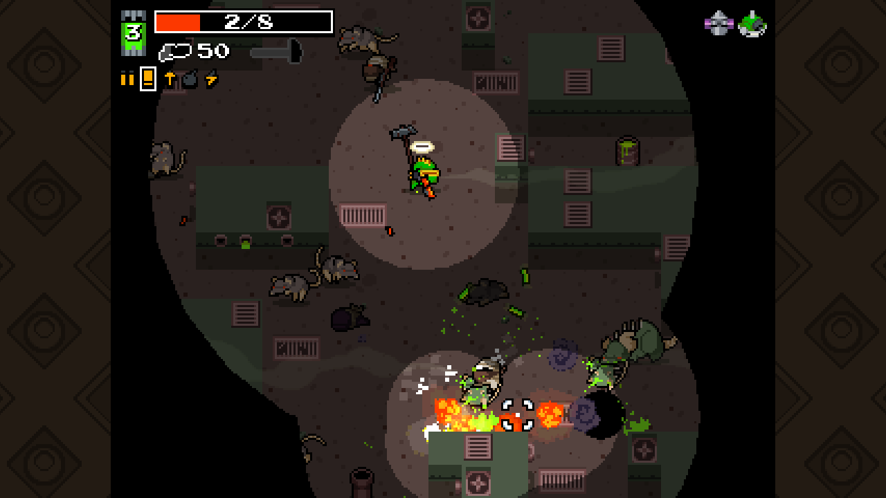
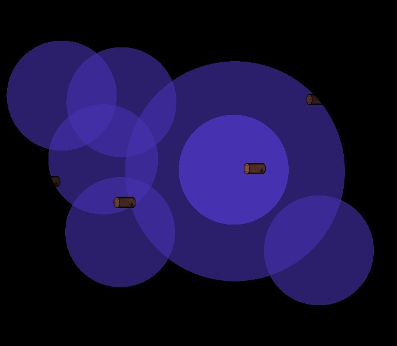
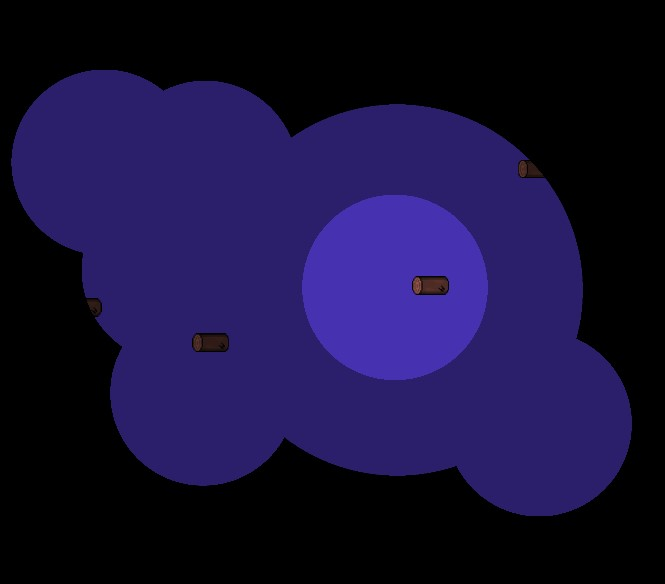

# Unity Mask Lighting

2D library that enables mask like lighting (similar to games like Nuclear Throne)



These assets are also used in my Ludum Dare 46 entry so you can test it out here: 
[Darkness Draws Near](https://ldjam.com/events/ludum-dare/46/darkness-draws-near)
| [Direct link](https://gibss.github.io/test/darkness-draws-near/v0.3/index.html)

## Integrate

Using the library requires a few steps:

- Download this <a id="raw-url" href="https://raw.githubusercontent.com/GibsS/unity-mask-lighting/master/mask-lighting.unitypackage">package</a>
- Import it into your project (you can place the folder wherever is most convenient)
- Drag the camera into your scene and delete any other cameras
- Create a layer called "Lighting" (or anything else)
- In the child camera, set the "Culling Mask" to only that "Lighting" layer
- In the parent camera, make sure "Lighting" is unticked in the "Culling Mask"
- To add a "Light", add an GameObject with a SpriteRenderer in the "Lighting" layer, the colours of the sprite will multiplied to other sprites

You can check the sample scene to get a better sense of how your scene needs to be layed out.

## Integrate in a scene with a preexisting camera

If you want to use an existing camera, you need to:

- Add a child camera to your main camera
- Set the the local position, local scale and roation to zero
- Create a layer called "Lighting" (or anything else)
- In the child camera, set the "Culling Mask" to only that "Lighting" layer
- In the parent camera, make sure "Lighting" is unticked in the "Culling Mask"
- Add the ```LightingCamera``` script to the main camera and set the main and light camera in the script (parent and child camera respectively)
- To add a "Light", add an GameObject with a SpriteRenderer in the "Lighting" layer and make sure the sprite is the shape and colour of the light you want

## Lighting modes

All that this library basically does is: 1. render your lights onto a texture 2. overlay that texture over everything else. The lighting sprites can be anything you desire but you can stick with white circles if you just want circular lights. But it doesn't even need to be a SpriteRenderer, it could also be a mesh. As long as it's part of the "Lighting" layer, it will act as a light.

By default, sprites in Unity use the Sprites-Default material which blends colors by adding them. I added a material called LightMaterial you can add to your light SpriteRenderer so that the "maximum" color is picked.

<p float="left">
  
   
</p>

The image on the left shows when lights use the default sprite material, the one on the right shows with the custom LightMaterial which uses the 
"maximum" color. Check the sample scene to understand how to reproduce the different effects.
